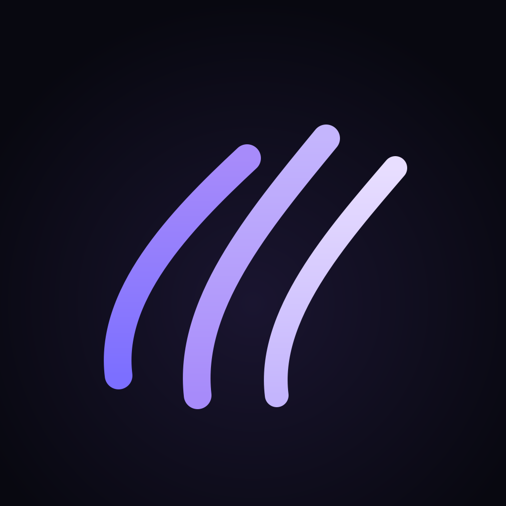

<p align="center">
  
</p>

<h1 align="center">WristClaw</h1>

<p align="center"><strong>Apple Watch voice / text / image interface for AI agents such as OpenClaw.</strong></p>

<p align="center">
  <a href="https://wristclaw.app">wristclaw.app</a> &nbsp;·&nbsp;
  <a href="https://wristclaw.app/#download">Download App</a> &nbsp;·&nbsp;
  MIT License
</p>

---

WristClaw lets you talk to your AI agent from your wrist. Hold the mic button, speak — the agent answers in audio, text, and images. Designed for [OpenClaw](https://openclaw.ai) but protocol-open: any backend that speaks the relay wire format works.

```
Apple Watch app ──── encrypted WSS ──── relay ──── OpenClaw agent
```

This repository contains the **server-side components**:

| Directory | What it is |
|-----------|-----------|
| `relay/`  | Stateless Go relay server — forwards encrypted frames between Watch and agent |
| `plugin/` | OpenClaw channel plugin — native WristClaw channel for the OpenClaw agent runtime |
| `mcp/`    | MCP bridge — exposes WristClaw as a Model Context Protocol tool server |
| `skill.md`| OpenClaw skill definition — teaches the agent how to pair and reply on the wrist |

The iOS/watchOS app is distributed through the App Store. Source is not included here.

---

## How it works

1. The iPhone app generates a **pairing payload** (UUID session ID + relay URL + X25519 public key).
2. You send the payload to your agent (via Telegram, WhatsApp, etc.). The agent's WristClaw skill recognises it and registers the relay session.
3. The Watch connects to the relay over HTTPS long-polling. The agent connects as the host. The relay forwards encrypted packets between them — it never sees plaintext.
4. Voice input is recorded on the Watch, sent as AAC audio, transcribed + processed by the agent, and the reply comes back as text + optional audio + optional image thumbnail.

**End-to-end encryption:** X25519 key exchange + ChaCha20-Poly1305. The relay is a dumb forwarder.

---

## Relay

A minimal Go HTTP server. No database, no auth, no state beyond in-memory session map.

```sh
cd relay
go build -o relay .
./relay          # listens on :8080 by default
```

Environment variables (see `.env.example`):

| Variable | Default | Description |
|----------|---------|-------------|
| `PORT`   | `8080`  | Listen port |
| `LOG_LEVEL` | `info` | `debug` / `info` / `warn` |

Docker:

```sh
cd relay
docker compose up -d
```

### Wire protocol

Binary packet format (little-endian):

```
[0:16]   session_id   UUID (16 bytes)
[16]     msg_type     uint8
[17:21]  seq          uint32
[21:25]  payload_len  uint32
[25:37]  nonce        12 bytes (ChaCha20-Poly1305 nonce)
[37:]    ciphertext   encrypted payload
```

Message types:

| Byte | Name | Direction | Description |
|------|------|-----------|-------------|
| 0x01 | handshake | both | X25519 public key exchange |
| 0x02 | audioInput | watch → host | raw AAC audio from mic |
| 0x03 | textInput | watch → host | UTF-8 text |
| 0x04 | audioResponse | host → watch | AAC audio reply |
| 0x05 | textResponse | host → watch | UTF-8 text reply |
| 0x06 | imageThumbnail | host → watch | JPEG ≤ 40 KB |
| 0x08 | heartbeat | both | keepalive |
| 0x0A | extensionDefine | host → watch | push a shortcut tab |
| 0x0B | extensionRemove | host → watch | remove a shortcut tab |
| 0x0C | extensionResponse | host → watch | streamed response to an extension tap |
| 0x0D | extensionInvoke | watch → host | user tapped an extension button |
| 0x0E | context | watch → host | ambient context snapshot (location, heart rate, …) |

### HTTP endpoints

```
POST /watch/join          Join as watch (role=1). Body: 17-byte join frame.
POST /watch/send          Send a packet from watch.
GET  /watch/poll?sid=...  Long-poll for packets addressed to this watch session.
POST /host/send           Send a packet from host (agent).
GET  /host/poll?sid=...   Long-poll for packets addressed to this host session.
GET  /health              Returns "ok".
```

---

## OpenClaw plugin

Registers WristClaw as a native OpenClaw channel so the agent can send/receive messages directly.

```sh
cd plugin
npm install
npm test
```

Install into OpenClaw:

```sh
curl -fsSL https://wristclaw.app/install.sh | bash
```

Or manually:

```sh
openclaw plugins install ./plugin
```

---

## MCP bridge

Exposes WristClaw relay operations as MCP tools so any MCP-compatible agent can interact with a paired Watch session.

```sh
cd mcp
pip install -r requirements.txt
cp .env.example .env   # fill in RELAY_URL and SESSION_ID
python server.py
```

---

## OpenClaw skill

`skill.md` is a skill definition that teaches an OpenClaw agent how to:

- Recognise a pairing payload sent by the user
- Register the native WristClaw channel
- Write replies optimised for the wrist (brevity, multimedia, language rules)
- Push and manage extension shortcut tabs

Install it by dropping `skill.md` into your OpenClaw skills directory, or copy its content into your agent's system prompt.

---

## Extensions

OpenClaw can push **shortcut tabs** to the Watch. Each tab has a button; tapping it sends `extensionInvoke` to the agent, which streams `extensionResponse` messages (text / audio / image) back.

```json
// Push a tab
{ "id": "ext-late", "title": "Am I late?", "icon": "clock.badge.exclamationmark", "buttonLabel": "Check meeting" }

// Respond to a tap
{ "id": "ext-late", "kind": "text", "text": "Standup in 8 min. You're on time." }
{ "id": "ext-late", "kind": "audio", "text": "Listen", "payload": "<base64 AAC>" }
```

See `skill.md` for the full extension protocol.

---

## Security

- The relay never decrypts payloads. It only checks the session UUID header to route frames.
- All application data is encrypted with **X25519 + ChaCha20-Poly1305** before leaving the device.
- The handshake is performed over the relay using ephemeral keys; the relay sees only the public keys.
- The relay does not log packet contents.

---

## License

MIT — see [LICENSE](LICENSE).

Built by [Matthias Sala](https://sala.ch).
